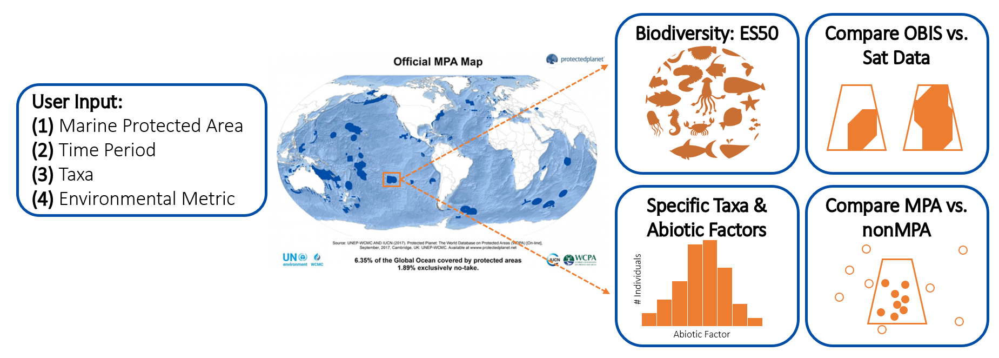

# Visualizing Marine Protected Areas and Biodiversity

2021 team: Lei Ma, Enrique Montes, Liz Sutter, Caroline Cappello, Tasha Gownaris, Ben Tupper, Nick Record
2020 team: Abby Benson, Rene Francolini, Natalie Posdaljian, Natalie Low, Kyle Oliveira, Camille Ross, Sam McNeely, Nick Record, Camille Ross, Angel Segura, Ben Tupper

## Purpose

**OBIS**
OBIS is a global open-access data and information clearing-house on marine biodiversity for science, conservation and sustainable development

**MPAS**
Conserved waters for a number of reasons including economic resources, biodiversity conservation, and species protection

**IUCN Category**
The International Union for Conservation of Nature has 7 categoies for classifying protected areas, ranging from "Ia Strict Nature Reserve" to "VI Protected area with sustainable use of natural resources"

## Previous year's accomplishments

## Goals for this year
1. Create an RShiny interface to implement user input for 
* selection and filtering of MPAs
* query of OBIS records based on selected MPAs
* display of biodiversity statistics correlating OBIS data with MPAs
2. Improve the backend functioning

## Demo of Shiny interface
<br>
<br>
<br>
<br>

## Preview of future features: Querying OBIS based on MPA polygons


```{r setup}
knitr::opts_chunk$set(echo = TRUE)
library(sf)
library(dplyr)
library(robis)
source("R-code/wdpar-package.R")

# robis::occurrence() expect filtering polygons in a well-known-text represerntation (aka WKT)
extract_polygon_geometry <- function(polygon) {
  polygon %>%
    sf::st_geometry() %>%
    sf::st_as_text()
}

get_one_mpa <- function(x, key){
   robis::occurrence(geometry = sf::st_as_text(sf::st_convex_hull(sf::st_geometry(x))))
}

convert_mpa_to_WKT <- function(x){
  st_as_text(st_convex_hull(st_geometry(x)))
}

get_datasets <- function(x){
  get_one_dataset <- function(x, key){
    robis::dataset(geometry=convert_mpa_to_WKT(x))
  }
  x %>% 
    dplyr::rowwise() %>% 
    dplyr::group_map(get_one_dataset, .keep=TRUE) %>% 
    dplyr::bind_rows()
}

```

```{r, cache=TRUE}
# reading in the global MDPA file
global <- wdpa_read_global(filestream=TRUE)
# subsetting for Belgium
belgium <- global %>% filter(ISO3 %in% "BEL")
# Retrieving all OBIS records for Belgium
bel_spoc <- belgium %>%
  dplyr::rowwise() %>%
  dplyr::group_map(get_one_mpa,
                   .keep = TRUE) %>%
  dplyr::bind_rows()
# Getting a subregion's OBIS records
belgium_sub_obis <- filter(belgium, WDPAID==555536869) %>% get_one_mpa()
```

## Belgium's OBIS data
We chose to use Belgium as an example for this section because it's very data rich for OBIS. The main OBIS office is in Belgium! In this small area there are `r nrow(bel_spoc)` observations. Here's an example of what the OBIS tables look like:

```{r display OBIS table}
head(bel_spoc %>% select(scientificName, class, infraclass, genus, eventDate))
```
So, even though Belgium's MPAs are a small area, for the purposes of this demo, we're going to only pull OBIS records for the tiny region in the northeast. In the Shiny App, we plan on having the user select MPAs by clicking or filtering by certain parameters such as IUCN category or year established and only pulling OBIS records from those regions. 
```{r plotting belgium}
# plot an example map of Belgium
leafletplot <- leaflet(data=belgium) %>% addProviderTiles(providers$Stamen.Watercolor, options = providerTileOptions(noWrap = TRUE)) %>% addPolygons(popup = ~sprintf("%s", WDPAID))
leafletplot
```

Here are all the observations from that region 
```{r visualize OBIS record locations}
# Visualize OBIS records for this 
leaflet() %>%
  addProviderTiles(provider = providers$Stamen.Watercolor) %>%
  addPolygons(data=filter(belgium, WDPAID==555536869)) %>% 
  addCircleMarkers(lat = belgium_sub_obis$decimalLatitude, lng = belgium_sub_obis$decimalLongitude, radius = 3, weight = 0, fillOpacity = .7, fillColor = "#CC3300")
```
## Biodiversity measurements for this region

**Explanation of ES50 measurement***
```{r}
# Plot of ES50 over time?
# Plot of alpha diversity over time?
```

## Biodiversity over time

